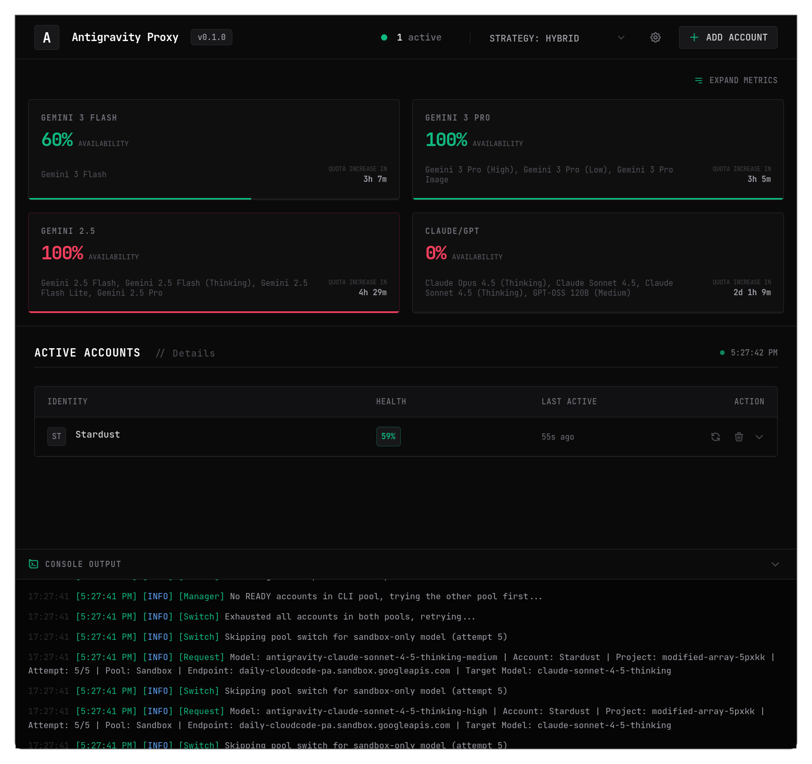

# Antigravity Proxy



Antigravity Proxy is a high-performance, Bun-native gateway that exposes Google's internal Gemini and Claude APIs through an **OpenAI-compatible interface**. It enables seamless integration between advanced models (like Claude 3.5 Sonnet, Gemini 3, and GPT-equivalent models) and CLI agents (such as **OpenCode** or **Claude Code**), as well as any application supporting the OpenAI API standard.

This project is strongly inspired by [opencode-antigravity-auth](https://github.com/NoeFabris/opencode-antigravity-auth).

## Features

- **OpenAI API Compatibility**: Full support for `v1/chat/completions` with streaming (SSE).
- **Multi-Agent Support**: Specifically designed to work with **Claude Code**, **OpenCode**, and other agentic frameworks.
- **Account Rotation & Health Scoring**: Automatically rotates multiple Google accounts, penalizing those with errors and favoring healthy ones.
- **Quota Management**: Real-time monitoring and automatic cooldowns (backoff) on `429 Too Many Requests` errors.
- **Dual-Pool Routing**:
  - **CLI Pool**: Routes to production endpoints (Gemini 2.5/3 Flash & Pro).
  - **Sandbox Pool**: Accesses internal/experimental models (Claude 3.5 Sonnet, Thinking models, GPT-equivalent).
- **Integrated Dashboard**: Manage accounts, monitor health, and view real-time logs via a built-in web interface.
- **Automatic Project Discovery**: Auto-detects Google Cloud Project IDs via Cloud SDK impersonation.

## Deployment Options

### Bunx (Recommended)
You can run the proxy instantly using `bunx`:
```bash
bunx antigravity-proxy@0.2.2
```

### Docker Hub
```bash
docker run -d -p 3000:3000 -e BASE_URL=http://localhost:3000 --name antigravity-proxy frieserpaldi/antigravity-proxy:0.2.2
```

### Local Execution (Bun)
Requirements: Bun (v1.0.0 or higher).
```bash
bun install
bun run start
```
The server starts on port 3000.

## Integration Guides

### Claude Code Configuration
To use **Claude Code** with Antigravity Proxy, point the API base URL to your local instance and specify a model from the Sandbox Pool:

```bash
# Point Claude Code to the proxy
export CLAUDE_CODE_API_BASE="http://localhost:3000/v1"

# Run Claude specifying an Antigravity model
claude --model antigravity-claude-sonnet-4-5
```

### OpenCode Configuration
Add the following provider to your `~/.config/opencode/opencode.json` under the `"provider"` key:

```json
"provider": {
    "antigravity-proxy": {
        "npm": "@ai-sdk/openai-compatible",
        "name": "Antigravity Proxy",
        "options": {
            "baseURL": "http://localhost:3000/v1"
        },
        "models": {
            "antigravity-gemini-3-pro-low": {
                "name": "Gemini 3 Pro Low (Antigravity)",
                "limit": { "context": 1048576, "output": 65535 }
            },
            "antigravity-gemini-3-pro-high": {
                "name": "Gemini 3 Pro High (Antigravity)",
                "limit": { "context": 1048576, "output": 65535 }
            },
            "antigravity-gemini-3-flash": {
                "name": "Gemini 3 Flash (Antigravity)",
                "limit": { "context": 1048576, "output": 65536 }
            },
            "antigravity-claude-sonnet-4-5": {
                "name": "Claude Sonnet 4.5 (Antigravity)",
                "limit": { "context": 200000, "output": 64000 }
            },
            "antigravity-claude-sonnet-4-5-thinking-low": {
                "name": "Claude Sonnet 4.5 Think Low (Antigravity)",
                "limit": { "context": 200000, "output": 64000 }
            },
            "antigravity-claude-sonnet-4-5-thinking-medium": {
                "name": "Claude Sonnet 4.5 Think Medium (Antigravity)",
                "limit": { "context": 200000, "output": 64000 }
            },
            "antigravity-claude-sonnet-4-5-thinking-high": {
                "name": "Claude Sonnet 4.5 Think High (Antigravity)",
                "limit": { "context": 200000, "output": 64000 }
            },
            "antigravity-claude-opus-4-6-thinking-low": {
                "name": "Claude Opus 4.6 Think Low (Antigravity)",
                "limit": { "context": 1000000, "output": 64000 }
            },
            "antigravity-claude-opus-4-6-thinking-medium": {
                "name": "Claude Opus 4.6 Think Medium (Antigravity)",
                "limit": { "context": 1000000, "output": 64000 }
            },
            "antigravity-claude-opus-4-6-thinking-high": {
                "name": "Claude Opus 4.6 Think High (Antigravity)",
                "limit": { "context": 1000000, "output": 64000 }
            },
            "antigravity-claude-opus-4-5-thinking-low": {
                "name": "Claude Opus 4.5 Think Low (Antigravity)",
                "limit": { "context": 200000, "output": 64000 }
            },
            "antigravity-claude-opus-4-5-thinking-medium": {
                "name": "Claude Opus 4.5 Think Medium (Antigravity)",
                "limit": { "context": 200000, "output": 64000 }
            },
            "antigravity-claude-opus-4-5-thinking-high": {
                "name": "Claude Opus 4.5 Think High (Antigravity)",
                "limit": { "context": 200000, "output": 64000 }
            },
            "gemini-2.5-flash": {
                "name": "Gemini 2.5 Flash (CLI)",
                "limit": { "context": 1048576, "output": 65536 }
            },
            "gemini-2.5-pro": {
                "name": "Gemini 2.5 Pro (CLI)",
                "limit": { "context": 1048576, "output": 65536 }
            }
        }
    }
}
```

## How It Works

Antigravity Proxy acts as a sophisticated bridge that translates OpenAI-formatted requests into Google's internal RPC protocols. It manages the complexities of authentication, session handling, and response streaming, allowing you to use high-tier models with your favorite tools.

### Account Selection Strategy
- **Hybrid (Default)**: Ranks accounts based on `(Health Score × 2) + (Idle Time × 0.1)`.
- **Sticky**: Keeps a client session tied to the same account for consistency.
- **Round-Robin**: Cycles through all available accounts evenly.

## Security Notes
- **Safety Filters**: Controlled via `SAFETY_THRESHOLD` (default: `BLOCK_NONE`).
- **Credentials**: OAuth tokens are stored locally in `antigravity-accounts.json`. Do not share or commit this file.

